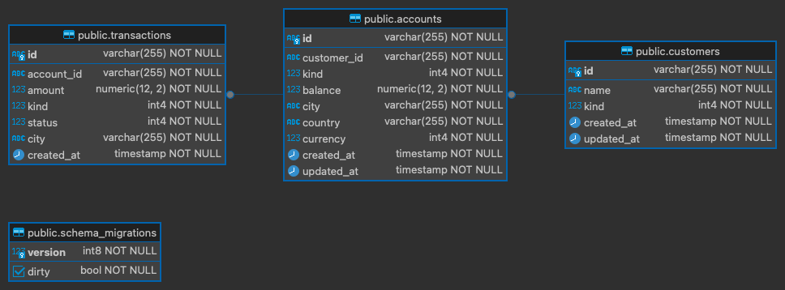

## Welcome to BlueSoft Bank

### Introduction
This development has been created for evaluation purposes. It was designed under **Hexagonal Architecture** (so-called "**Ports and Adapters**").

### Note: Please the document until the end, there are several things WIP.
(Sorry for the above text in bold)


## Technologies used

- Golang 1.22 with Gin Framework
- Docker 27.0.3
- Docker Compose 2.28.1
- PostgreSQL 16.3

## Database design

This exercise has a simple database design, but effective for acomplising the objectives required:




## Some decisiones made

- Although it is a relatively simple exercise, I developed it based (obviously) in my own experience but incorporating some stuff learned from books too: In this case it was **Hexagonal Architecture (HA)** also known as **Ports and Adapters**, the intensive usage of **SOLID principles** brings to me to make this decision, especially for Dependency Injection principle and Liskov Substituion principle.
- **Why don't use MVC**? Is a good question, the answer is really easy: I think that HA flows more natural and give more abstraction and isolation of the components than MVC, this means less coupling among the layers too. Although HA is agnostic, the implementation with Go is wonderful, there are many readings about that.
- The usage of PostgreSQL is related to ease to usage, but I wanted at first time use 2 database to switch and test the repository pattern (the second one db keep in mind was MongoDB).


## Bootstrapping

At the moment of writting this document, the complete app hasn't been dockerized yet, so we need to setup the database:
```bash
# In the root of the project, I mean ./bluesoft-bank-solution
$ docker compose up -d # Watch out, we're running this docker compose in background
```

**Running the app**


```bash
# This command includes the migrations routine.
$ cd cmd/app
$ go run main.go # The app will run on port 8080
```

**Attention**
There's a Postman collection on which you can create customers, accounts and add new transactions.
[Let me leave it here for you!](bluesoft-api.postman_collection.json)

Please pay much attention to order of each tab.


## WIP
  1. Write tests.
  2. Results pagination.
  3. Develop a frontend project in order to improve the interactivity.
  4. Dockerize the application completely, this includes the main app.